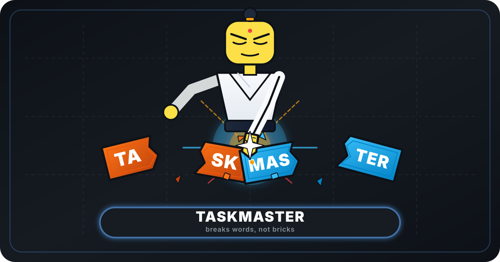
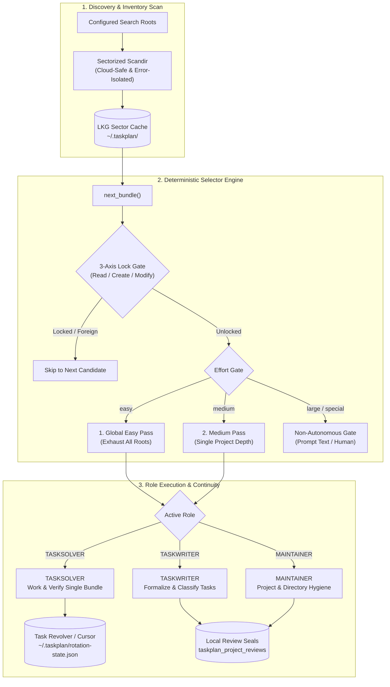
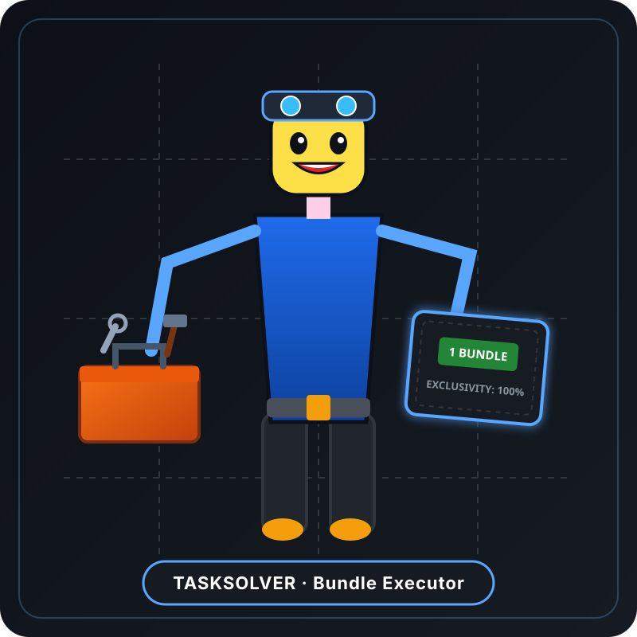
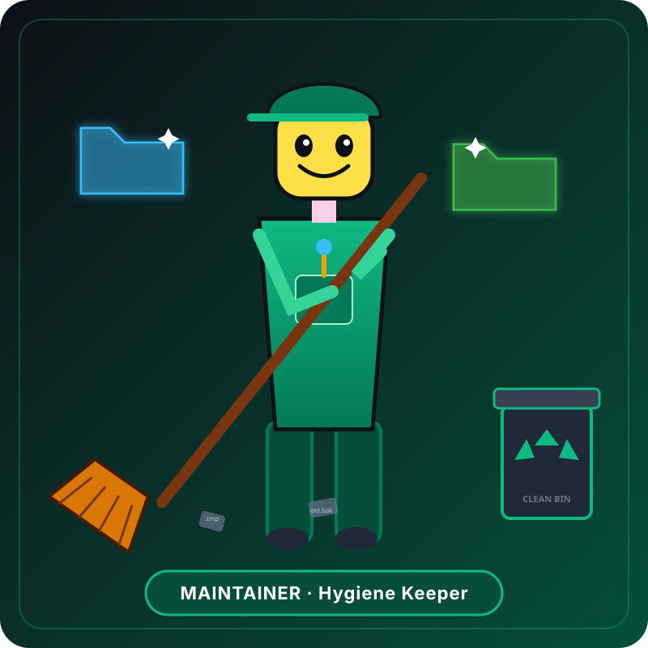

<p align="center">
  
</p>

# TaskMaster

[](https://www.python.org/)
[](LICENSE)
[](https://github.com/ellmos-ai)
[](https://github.com/open-bricks)
[-success.svg)](pyproject.toml)
[](tests/)
[](llms.txt)

**Deterministic task selection for LLM agents.** Zero dependencies, stdlib only,
Python ≥ 3.10.

> [!NOTE]
> **AI / LLM Integration**: `taskplan` provides deterministic selection guards and role prompts for autonomous AI agents. For detailed system concepts and documentation overview, see [llms.txt](llms.txt).

*[Deutsche Fassung → README_de.md](README_de.md)*

Most agent task loops let the *model* decide what to work on next. That sounds
flexible, and it fails in a specific, predictable way: the model picks whatever is
most visible, cleans it up, and eventually reports *"nothing left to do"* — while the
real backlog sits one directory level below, unread.

taskplan moves that decision **out of the prompt and into code**. A deterministic
selector decides *what* comes next; the model keeps the judgment calls (*is this easy?
is it safe? did it pass?*).

---

## The rule the selector enforces

```
  Surface sweep (all roots)
    → deep dive: EASY, in one root
    → back to the surface
    → deep dive: EASY, in the next root
    → … until NO root has easy work left
    → only then: the medium pass
```



**Effort is the primary sort dimension; root rotation is only secondary.** Easy tasks
are exhausted *globally* before a medium one is touched anywhere.

That is not tidiness. Easy tasks are exactly what unblocks whoever is deep inside a
hard problem somewhere else. Clearing a small thing in project A is worth more than
going deeper in project B. That is *why* the easy/medium distinction exists at all.

## Gates that live in code, not in prose

| Effort | Meaning | Autonomous? |
|---|---|---|
| `easy` | one or few files, one project, reversible, mechanically verifiable | **always** |
| `medium` | several files in **one** project, no architectural change | only when no `easy` is left anywhere |
| `large` | architecture, cross-project, migration | **never** |
| `special` | needs domain knowledge, credentials, or an irreversible action | **never** |
| *(empty)* | unclassified | **not treated as easy** — better left alone than wrongly assumed harmless |

`scope = "central"` (shared infrastructure others build on) is never autonomous
either, regardless of effort.

When nothing is selectable, `next_bundle()` returns `None`. The loop ends as an
**honest no-op** instead of inventing work to fill itself.

---

## Roles

<p align="center">
  
  &nbsp;
  
  &nbsp;
  
</p>

- **TASKSOLVER**: Focused executor with toolbox. Executes exactly ONE project bundle per pass.
- **TASKWRITER**: Chronicler with pen and list. Classifies tasks with effort/scope (*"an unrated task is invisible"*).
- **MAINTAINER**: Caretaker with broom. Keeps files and folder structures clean and tidy.

### Policy-aware maintenance plans

The MAINTAINER resolves applicable project rules and policy metadata before a
mutation, then passes one evidenced JSON finding through a deterministic,
fail-closed planner:

```bash
python -m taskplan maintainer-plan --input finding.json \
  --existing-fingerprints open-ticket-fingerprints.json
```

The input records observed facts, not commands:

```json
{
  "kind": "placement",
  "locator": "docs/legacy.md",
  "summary": "Historical document is in the project root",
  "evidence": ["docs/legacy.md:1", "README.md:120"],
  "policy": {"resolution": "none"},
  "destination": {
    "path": "docs/archive/legacy.md",
    "content_evidence": "The header declares the document historical.",
    "provenance": "Git history and document header"
  },
  "gates": {
    "authorized": true, "reversible": true, "foreign_lock": false,
    "user_lock": false, "hard_delete": false, "symlink_safe": true,
    "cloud_safe": true, "dirty_git_safe": true, "secret_safe": true
  },
  "impact": {
    "systemwide": false, "cross_host": false,
    "causal_policy_conflict": false, "requires_user_decision": false
  }
}
```

The output classifies the finding as `safe_autofix`, `needs_ticket`,
`needs_system_audit`, `needs_user_decision`, or `informational`. Only
`safe_autofix` permits a mutation. Missing policy adoption, foreign/user locks,
unproven rollback, hard-delete requests, unsafe links/cloud placeholders,
unknown dirty-Git ownership, and secret risk fail closed.

The planner performs no move, audit, or ticket operation. The role consumes
neighbouring modules through their stable surfaces: `policy-registry
resolve/verify`, read-only `system-auditor discover`, and ticket-master's
canonical list/writer tools. Because system-auditor deliberately has no finding
ingest endpoint, systemwide findings become one deduplicated audit-handoff
ticket rather than a second audit store. `MAINTAINER_FINGERPRINT` suppresses
duplicate tickets. Evidence-based placement may remain policy-free when content,
provenance, and the project contract prove one destination; the absence of a
universal naming policy does not invent a new policy.

---

## Quick start

```python
from taskplan import api as tasks

tasks.init(agent_id="opus")
tasks.add("Fix encoding in docs", priority="high", effort="easy",
          project_path="/repos/foo", root_id="OSS")

for t in tasks.list(effort="easy", scope="local"):
    print(f"[{t['id']}] {t['title']}")

tasks.done(1)
```

Ask the selector what to do next:

```bash
python -m taskplan next            # mode, effort, project, task IDs, permissions
python -m taskplan doctor          # which database am I actually using?
python -m taskplan projects list   # what does the loop see?
python -m taskplan projects markers
```

`next` writes the same human-readable designation to the console and, with
`--json`, to `exit.code`, `exit.name`, and localized `exit.meaning`:

| Code | Stable name | Meaning |
|---:|---|---|
| `0` | `BUNDLE_READY` | Bundle delivered successfully |
| `1` | `NO_WORK` | Role is active, but no eligible bundle is currently available |
| `2` | `ROLE_DISABLED` | Role is disabled in configuration |
| `3` | `RETRYABLE_SELECTOR_ERROR` | Retryable selector/discovery error |

Project-only MAINTAINER bundles and TASKWRITER discovery sweeps intentionally
contain no task IDs. They use a separate, host-local seal per `(role, project)` in
the same SQLite database. `next` first records a short presentation lease and returns
`review.presentation_id`; presentation alone is never success. Only a confirmed
completion stores the current deterministic project hash, result, review time and
next due time. A blocker is deferred without writing success:

```bash
python -m taskplan review complete --role maintainer --project "<path>" \
  --presentation-id "<id>" --result "checked"
python -m taskplan review defer --role taskwriter --project "<path>" \
  --presentation-id "<id>" --reason "blocked"
python -m taskplan review unseal --role maintainer --project "<path>" \
  --reason "manual recheck"
python -m taskplan review status --role maintainer --project "<path>" --json
```

An unchanged seal before `next_due_at` is not presented. A content-hash change,
due interval, manual unseal, or never-presented project opens it. Git metadata,
caches, builds, TASKPLAN's own locks, and configured glob exclusions do not churn
the hash. Diagnostics distinguish locks, active leases, deferred projects,
unchanged seals, hash breaks, due reviews, manual unseals, and hash errors.

Selection first sorts states whose eligibility is already known without reading
every project tree. Content is hashed only when a state decision needs it or a
candidate is about to be presented. Every candidate that is actually attempted is
hashed again immediately before the transaction, independently of any digest used
for eligibility. Only that fresh digest is validated, stored, and returned. A hash
failure excludes the candidate fail-closed and selection continues; diagnostics
leave `current_hash` empty whenever no hash was computed.

The TASKSOLVER keeps its existing task-level revolver and project cursor at
`~/.taskplan/rotation-state.json` (configurable with
`[loop].rotation_state_file`). When a stale or temporarily unusable task project
must be bypassed, it can still advance that cursor explicitly:

```bash
python -m taskplan skip --role tasksolver --project "<path>"
```

The canonical TASKSOLVER prompt keeps a per-task/bundle attempt count across
continuations. After the third documented failure, it records an explicit SKIP
reason, leaves the task open, advances the existing project cursor, and asks the
selector for other autonomous work. A local `cldflt.sys` risk remains fail-closed;
locks, foreign state, divergent history, and every other safety gate are unchanged.
The work sweep is not considered empty until all reachable candidates have been
checked. This is a prompt contract over the existing project cursor, not a new
task-state or retry engine.

New tasks remain the responsibility of the TASKWRITER/TASKSOLVER flow. Project
review rows never change `created_by`, `assigned_to`, or any task status.

### Who created it, who works on it

`agent_id` used to carry three meanings at once (creator, worker, role) and was
**overwritten on assignment** — so the origin was lost the moment someone picked a
task up. Now they are separate:

```python
client.add("…")                      # sets created_by  (immutable)
client.assign(task_id, to="claude")  # sets assigned_to + delegation_status
```

Whoever takes a task writes to `assigned_to` — **never** to the field carrying the
origin.

`origin_host` records the live hostname (`socket.gethostname()`) at creation time —
set once by `add()`, never touched by `update()`/`assign()`, and left `NULL` on rows
that predate the column (origin can't be reconstructed after the fact).

---

## Three roles

| Role | Does | Never does |
|---|---|---|
| **TASKWRITER** | finds and formalizes tasks, **classifies effort/scope** | execute them |
| **TASKSOLVER** | works a bundle, verifies it, claims it via `assign()` | choose the project |
| **MAINTAINER** | keeps files and directories clean, curates project discovery | write or solve tasks |

The writer is upstream: **an unclassified task is an invisible task**, because the
solver refuses to guess at its size.

Before its first selector call, every TASKSOLVER provider performs a one-time
TASKPLAN control-plane preflight: `doctor`, effective runtime/profile wiring,
evidence-based maintenance of TASKPLAN itself, and a current model check against
official provider sources plus local CLI availability. A model is changed only
when role capability, stability, latency, and cost show a clear benefit. This does
not authorize general project tidying; normal project work still begins with the
selector.

Prompts ship with the package (`taskplan.TASKSOLVER`, `.TASKWRITER`, `.MAINTAINER`) —
as resources, not hardcoded strings, and resolvable as real files for external
launchers:

```python
from taskplan import list_workflows, get_workflow_prompt, get_workflow_prompt_path
```

### Prompt language

All three roles exist in **English and German**. Default is English; the module is
meant to be user-neutral.

```toml
[language]
prompts = "de"        # de | en
```

Override for a single run with `TASKPLAN_LANG=de`. A missing translation falls back
to English **with a warning** — the prompt is the role's contract, and a silent
language switch would be worse than a loud one. Tests assert that every promise
survives translation, in both directions.

---

## Everything is configurable — nothing is hardcoded

See [`taskplan.example.toml`](taskplan.example.toml) for the fully commented version.

### Storage

SQLite is the recommended default, but the selector talks to a narrow `TaskStore`
protocol and **knows no SQL**. A `files` backend keeps the truth in your `TODO.md`
files — no database at all. Foreign systems plug in via entry point.

Resolution order: env `TASKPLAN_DB` → `taskplan.toml` `[storage].path` → env
`RINNSAL_DB` → `~/.taskplan/taskplan.db`.

> `python -m taskplan doctor` warns when the *active* database is empty while another
> one holds data. That silent failure mode — writing into a database nobody reads, no
> error, no warning, just no effect — is exactly what it exists to catch.

### Project discovery

Five marker categories, each switchable, combined with a real boolean expression:

```toml
[traversal.markers]
expression = "(dir_patterns AND files) OR git"   # AND / OR / NOT, parentheses
```

| # | Category | Detects |
|---|---|---|
| 1 | `dir_patterns` | patterns in the folder name |
| 2 | `files` | marker files (`CLAUDE.md` is more specific than `TODO.md`) |
| 3 | `subdirs` | marker directories (`.claude`) |
| 4 | `git` | a repository — including worktrees/submodules, where `.git` is a **file** |
| 5 | `flag_file` | an explicit marker; beats every heuristic |

The expression parser is hand-written, **not `eval`** — a config file must never
execute arbitrary code. A typo in a marker name is an **error**, not a silent
"never matches"; otherwise the loop would quietly find nothing at all.

Not enough? `discovery = "manual"` uses a hand-curated registry instead of (or
alongside) the automatic scan. The MAINTAINER keeps it up to date.

> **A trap worth knowing — measured on a real system.** Folder-name patterns are
> *dangerous* with `combine = "any"` if your intermediate levels follow the same
> convention as your projects. Categories named `CASH`, `DATA`, `CODING` match an
> uppercase pattern just like the projects beneath them — the scan stops at the
> category and never descends. Result: **46 wrong "projects" instead of 91 real
> ones.** `dir_patterns AND files` fixes it. That is why `dir_patterns` defaults to
> *off*.

### Locks — three axes, not one switch

| Action | Rule |
|---|---|
| read / analyze | **always allowed** — a lock protects against *change*, not against *knowledge* |
| create a new file | usually allowed (does not collide with work on existing files) |
| modify a file | only without a foreign lock in scope |

And crucially: **a lock in one project locks that project** — not its siblings, and
not the whole pipeline.

Different system, different lock scheme? `provider = "rules"` evaluates **nothing** —
it passes your rule files through as *text into the prompt*. Better an agent that
reads the real rule than a parser that guesses at its meaning.

### Locking and discovery benchmark

The repository contains a cost-free, stdlib-only process benchmark for the three
local coordination surfaces:

```powershell
python benchmarks/taskplan_locking.py --workers 4 --tasks-per-worker 20 --projects 200 --output results/benchmark_locking_YYYYMMDD.json
```

It measures a bounded discovery scan, concurrent SQLite task writes, and a
same-resource `LOCK*.txt` race with LockMaster readback. The run is explicitly a
local-process simulation; it does not certify SMB/NFS/OneDrive or physical
multi-machine behavior. See [`benchmarks/README.md`](benchmarks/README.md).

### Roles, models, task sources, depth

All switchable. A disabled role **aborts cleanly on start** instead of silently
idling. `combined = true` is currently parsed and exposed as configuration, but no
bundled runner or launcher consumes it yet; it is therefore not a functional
3-in-1/2-in-1 mode. Model choice belongs in the config, not in the launcher.

### Provider-neutral runtime and Codex goals

Launchers are intentionally thin. `[execution] provider` selects a default provider;
`[providers.<name>.models]` and `[providers.<name>.reasoning_effort]` select values
per role. The legacy `[models]` section remains a compatible fallback. For Codex,
blank or missing values mean "no TASKPLAN override": the launcher omits those CLI
flags and Codex inherits its canonical `~/.codex/config.toml` defaults. This avoids
a second mandatory model configuration on every host while preserving explicit
role overrides.

Codex uses `continuation = "goal"`. TASKPLAN generates an explicit user startup
prompt that authorizes a persisted goal, processes one bundle per continuation,
then asks the selector again. `empty_policy = "keep_goal"` prevents a single empty
result from being mistaken for a permanently empty queue. The generated goal
contract must call `python -m taskplan backoff ...`; that command performs the real
`idle_backoff_seconds` wait before polling again. `python -m taskplan runtime ...`
exposes the profile to any shell; `python -m taskplan startup-prompt ...` emits the
provider-specific user request. No user name, home path, or model is hardcoded in
the launcher.

The wheel includes twelve user-neutral Windows launchers for
TASKSOLVER/TASKWRITER/MAINTAINER × Claude/Codex/Agy/Kimi:

```powershell
python -m taskplan starters list
python -m taskplan starters path --role tasksolver --provider codex
python -m taskplan launch --role tasksolver --provider codex
```

Configure model identifiers and reasoning levels in `~/.taskplan/taskplan.toml`.
For Codex these entries are optional role-specific overrides; without them the
Codex CLI configuration remains authoritative. Other providers still require
TASKPLAN model and reasoning entries.
`TASKPLAN_WORKDIR` optionally selects the worker directory;
`TASKPLAN_CLAUDE_MCP_CONFIG` optionally supplies a Claude MCP profile. Packaged
launchers use normal provider permission prompts by default. Only a trusted local
automation should set `TASKPLAN_TRUSTED_AUTOMATION=1` to request unattended write
permissions. `TASKPLAN_STARTER_DRY_RUN=1` prints the resolved command without
starting the provider. An AGY launcher can set
`TASKPLAN_AGY_SCHEDULE_MINUTES=<positive integer>` so the generated startup
request tells AGY itself to create an external recurring schedule with no expiry;
each trigger remains a one-shot worker and no in-process endless loop is started.

Project discovery has its own `discovery_timeout_seconds` and a portable,
sectorized snapshot cache under `~/.taskplan/`. `cache_ttl_seconds` defaults to
`86400` (24 hours) and is a refresh interval, not an expiry date. Each selector
process refreshes at most one configured root sector. A sector that stalls is
recorded as attempted and rotates behind other due sectors on the next run.

Previously known projects remain usable as last-known-good data until their sector
has been replaced by a successful refresh—even after the interval elapsed or the
discovery policy changed. Model, provider, and reasoning changes no longer
invalidate the project inventory. The directory walker uses one `scandir` operation
per directory and isolates per-entry errors, mirroring the cloud-tolerant pattern
used by FileCommander without depending on it.

On a cloud-filesystem timeout, `next` continues in this order: sector cache plus
manual registry, then known `project_path` values from the task store. Exit `3` is
returned only when discovery failed and no safe local inventory remains; otherwise
the JSON `discovery` object identifies `source`, `degraded`,
`cache_age_seconds`, `refreshed_sector`, `pending_sectors`, and warnings.

```toml
[traversal]
discovery_timeout_seconds = 30
cache_ttl_seconds = 86400  # per-root refresh interval; LKG survives failures
```

---

## Tasks are not tickets

Tasks (this module) and tickets (file-based systems, IDs like `T-YYYYMMDD-NN`) are
**separate systems**. Tickets *can* become tasks, but need not. The only bridge is
`api.add_from_ticket(...)`, which creates a normal task tagged `ticket:<id>`.
taskplan never imports, mirrors, or manages tickets.

## Origin & compatibility

Third pillar of the `.MEMORY` stack — **USMC** (curated session memory) · **GARDENER**
(organic memory + cross-source index) · **TASKPLAN** (tasks). Extracted from
`rinnsal/tasks`; rinnsal imports it back through a seam with a bundled fallback.

The table name **`rinnsal_tasks` is kept deliberately**, and schema changes are
**additive only** — existing readers keep working without migration.

Statuses: `open`, `active`, `done`, `cancelled` · Priorities: `critical`, `high`,
`medium`, `low` · Efforts: `easy`, `medium`, `large`, `special` · Scopes: `local`,
`central`.

## Tests

```bash
python -m pytest tests/ -q
```

## Ecosystem & Related Modules

`taskplan` is part of the [`ellmos-ai`](https://github.com/ellmos-ai) ecosystem under the [`open-bricks`](https://github.com/open-bricks) umbrella:

- [gardener](https://github.com/ellmos-ai/gardener) — Organic memory and cross-source knowledge index
- [workflowhooker](https://github.com/ellmos-ai/workflowhooker) — Deterministic hook and lifecycle automation for LLM workflows
- [sqlite-transit-sync](https://github.com/ellmos-ai/sqlite-transit-sync) — Local SQLite snapshot transport and merge engine
- [ticket-master](https://github.com/ellmos-ai/ticket-master) — Standalone ticket and issue tracking
- [open-bricks](https://github.com/open-bricks) — Umbrella organization for modular development tools

## License

MIT — Lukas Geiger
