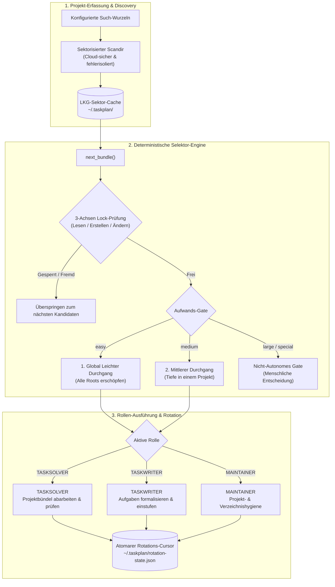

<p align="center">
  
</p>

# TaskMaster

[](https://www.python.org/)
[](LICENSE)
[](https://github.com/ellmos-ai)
[](https://github.com/open-bricks)
[-success.svg)](pyproject.toml)
[](tests/)
[](llms.txt)

**Deterministische Aufgabenauswahl für LLM-Agenten.** Keine Abhängigkeiten, nur
Standardbibliothek, Python ≥ 3.10.

> [!NOTE]
> **KI / LLM Integration**: `taskplan` stellt deterministische Selektions-Guards und Rollen-Prompts für autonome KI-Agenten bereit. Detaillierte Systemkonzepte und Modulübersichten finden sich in [llms.txt](llms.txt).

*[English version → README.md](README.md)*

Die meisten Agenten-Loops lassen das *Modell* entscheiden, woran es als Nächstes
arbeitet. Das klingt flexibel und scheitert auf eine sehr bestimmte, vorhersagbare
Weise: Das Modell nimmt sich, was am sichtbarsten ist, räumt es auf — und meldet
irgendwann *„nichts mehr zu tun"*, während der eigentliche Rückstand eine
Verzeichnisebene tiefer ungelesen liegt.

taskplan holt diese Entscheidung **aus dem Prompt heraus und in den Code**. Ein
deterministischer Selektor entscheidet, *was* dran ist; beim Modell bleibt das Urteil
(*Ist das leicht? Ist es sicher? Hat es bestanden?*).

---

## Die Regel, die der Selektor durchsetzt

```
  Oberflächen-Durchgang (alle Roots)
    → Tiefgang: LEICHT, in einer Root
    → zurück an die Oberfläche
    → Tiefgang: LEICHT, in der nächsten Root
    → … bis KEINE Root mehr leichte Arbeit hat
    → erst dann: der mittlere Durchgang
```



**Der Aufwand ist die primäre Sortierdimension, die Root-Rotation nur die
sekundäre.** Leichte Aufgaben werden **systemweit** erschöpft, bevor irgendwo eine
mittlere angefasst wird.

Das ist keine Ordnungsliebe. **Leichte Aufgaben entlasten genau die, die anderswo
tief in einem schweren Thema stecken.** Eine liegengebliebene Kleinigkeit in Projekt
A abzuräumen ist mehr wert, als in Projekt B in die Tiefe zu gehen. Genau *dafür*
gibt es die Unterscheidung leicht/mittel überhaupt.

## Gates, die im Code stehen — nicht in Prosa

| Aufwand | Bedeutung | Autonom? |
|---|---|---|
| `easy` | eine oder wenige Dateien, ein Projekt, reversibel, mechanisch prüfbar | **immer** |
| `medium` | mehrere Dateien in **einem** Projekt, kein Architekturwechsel | nur wenn nirgends mehr `easy` offen ist |
| `large` | Architektur, projektübergreifend, Migration | **nie** |
| `special` | braucht Fachwissen, Zugangsdaten oder eine irreversible Aktion | **nie** |
| *(leer)* | unklassifiziert | **gilt nicht als leicht** — lieber liegen lassen als fälschlich für harmlos halten |

`scope = "central"` (geteilte Infrastruktur, auf die andere bauen) ist ebenfalls nie
autonom, unabhängig vom Aufwand.

Ist nichts wählbar, gibt `next_bundle()` **`None`** zurück. Der Loop endet als
**ehrlicher Leerlauf**, statt sich Arbeit zu erfinden, um sich zu füllen.

---

## Rollen

<p align="center">
  
  &nbsp;
  
  &nbsp;
  
</p>

- **TASKSOLVER**: Macher mit Werkzeugkasten. Arbeitet genau EIN Projekt-Bündel pro Durchgang ab.
- **TASKWRITER**: Chronist mit Stift und Liste. Stuft Aufgaben mit effort/scope ein (*„eine uneingestufte Aufgabe ist unsichtbar"*).
- **MAINTAINER**: Hausmeister mit Besen. Hält Dateien und Ordnerstrukturen sauber und ordentlich.

### Policy-aware Wartungspläne

Der MAINTAINER löst vor jeder Mutation die anwendbaren Projektregeln und
Policy-Metadaten auf. Danach gibt er genau einen belegten JSON-Befund an einen
deterministischen, fail-closed arbeitenden Planer:

```bash
python -m taskplan maintainer-plan --input finding.json \
  --existing-fingerprints open-ticket-fingerprints.json
```

Die Eingabe hält beobachtete Fakten fest, keine Befehle:

```json
{
  "kind": "placement",
  "locator": "docs/legacy.md",
  "summary": "Historical document is in the project root",
  "evidence": ["docs/legacy.md:1", "README.md:120"],
  "policy": {"resolution": "none"},
  "destination": {
    "path": "docs/archive/legacy.md",
    "content_evidence": "The header declares the document historical.",
    "provenance": "Git history and document header"
  },
  "gates": {
    "authorized": true, "reversible": true, "foreign_lock": false,
    "user_lock": false, "hard_delete": false, "symlink_safe": true,
    "cloud_safe": true, "dirty_git_safe": true, "secret_safe": true
  },
  "impact": {
    "systemwide": false, "cross_host": false,
    "causal_policy_conflict": false, "requires_user_decision": false
  }
}
```

Die Ausgabe klassifiziert den Befund als `safe_autofix`, `needs_ticket`,
`needs_system_audit`, `needs_user_decision` oder `informational`. Nur
`safe_autofix` erlaubt eine Mutation. Fehlende Policy-Adoption, Fremd-/User-Locks,
unbelegter Rollback, Hard-Delete-Aufträge, unsichere Links/Cloud-Platzhalter,
ungeklärtes Dirty-Git-Eigentum und Secret-Risiken blockieren fail-closed.

Der Planer verschiebt keine Datei, führt kein Audit aus und erzeugt kein Ticket.
Die Rolle nutzt Nachbarmodule nur über stabile Oberflächen: `policy-registry
resolve/verify`, das read-only arbeitende `system-auditor discover` und die
kanonischen Listen-/Writer-Werkzeuge des ticket-master. Weil system-auditor
bewusst keinen Finding-Ingest-Endpunkt besitzt, wird ein systemweiter Fund zu
genau einem deduplizierten Audit-Handoff-Ticket statt zu einer zweiten
Auditablage. `MAINTAINER_FINGERPRINT` verhindert doppelte Tickets. Eine empirisch
belegte Ablage darf ohne universelle Policy auskommen, wenn Inhalt, Provenienz und
Projektvertrag genau einen Zielort belegen; das Fehlen einer allgemeinen
Benennungspolicy erfindet keine neue Policy.

---

## Schnellstart

```python
from taskplan import api as tasks

tasks.init(agent_id="opus")
tasks.add("Encoding in der Doku korrigieren", priority="high", effort="easy",
          project_path="/repos/foo", root_id="OSS")

for t in tasks.list(effort="easy", scope="local"):
    print(f"[{t['id']}] {t['title']}")

tasks.done(1)
```

Den Selektor fragen:

```bash
python -m taskplan next            # Modus, Aufwand, Projekt, Task-IDs, Rechte
python -m taskplan doctor          # welche Datenbank benutze ich eigentlich?
python -m taskplan projects list   # was sieht der Loop?
python -m taskplan projects markers
```

`next` schreibt dieselbe verständliche Bezeichnung in die Konsole und mit `--json`
in `exit.code`, `exit.name` und das lokalisierte Feld `exit.meaning`:

| Code | Stabiler Name | Bedeutung |
|---:|---|---|
| `0` | `BUNDLE_READY` | Bündel erfolgreich geliefert |
| `1` | `NO_WORK` | Rolle aktiv, aber derzeit kein zulässiges Bündel |
| `2` | `ROLE_DISABLED` | Rolle ist in der Konfiguration deaktiviert |
| `3` | `RETRYABLE_SELECTOR_ERROR` | Wiederholbarer Selektor-/Discovery-Fehler |

Reine MAINTAINER-Projektbündel und TASKWRITER-Erfassungsläufe enthalten
absichtlich keine Task-IDs. Der Selektor speichert für jede Rolle einen getrennten
Cursor atomar unter `~/.taskplan/rotation-state.json` (konfigurierbar über
`[loop].rotation_state_file`) und liefert beim nächsten Lauf den nächsten
Kandidaten. Der TASKSOLVER rückt normalerweise durch das Erledigen seines
Task-Bündels weiter; ein veraltetes oder vorübergehend nicht bearbeitbares Projekt
kann mit demselben expliziten Cursor übersprungen werden:

```bash
python -m taskplan skip --role maintainer --project "<pfad>"
python -m taskplan skip --role taskwriter --project "<pfad>"
python -m taskplan skip --role tasksolver --project "<pfad>"
```

Der kanonische TASKSOLVER-Prompt zählt Fehlversuche je Task/Bündel über
Fortsetzungen hinweg. Nach dem dritten dokumentierten Fehlschlag schreibt er einen
ausdrücklichen SKIP-Grund, lässt die Aufgabe offen, setzt den vorhandenen
Projektcursor weiter und fragt den Selektor nach anderer autonomer Arbeit. Ein
lokales `cldflt.sys`-Risiko bleibt fail-closed; Locks, Fremdzustand, divergente
Historie und alle anderen Schutzgates bleiben unverändert. Der Arbeitssweep gilt
erst nach Prüfung aller erreichbaren Kandidaten als leer. Dies ist ein
Prompt-Vertrag über den bestehenden Projektcursor, kein neuer Task-Status oder
Retry-Engine.

Neue Aufgaben bleiben der TASKWRITER-/TASKSOLVER-Rollenstrecke vorbehalten.

### Wer hat es angelegt, wer arbeitet daran

`agent_id` trug früher **drei Bedeutungen zugleich** (Anleger, Bearbeiter, Rolle) und
wurde **beim Zuweisen überschrieben** — die Herkunft war also weg, sobald jemand eine
Aufgabe übernahm. Jetzt sind sie getrennt:

```python
client.add("…")                      # setzt created_by  (unveränderlich)
client.assign(task_id, to="claude")  # setzt assigned_to + delegation_status
```

`origin_host` speichert den Live-Hostnamen (`socket.gethostname()`) zum Anlage-
zeitpunkt — einmalig von `add()` gesetzt, von `update()`/`assign()` nie berührt,
und `NULL` bei Zeilen aus der Zeit vor dieser Spalte (Herkunft ist rückwirkend
nicht rekonstruierbar).

Wer eine Aufgabe übernimmt, schreibt in `assigned_to` — **niemals** in das Feld, das
die Herkunft trägt.

---

## Drei Rollen

| Rolle | Tut | Tut nie |
|---|---|---|
| **TASKWRITER** | erkennt und formalisiert Aufgaben, **stuft Aufwand/Scope ein** | sie ausführen |
| **TASKSOLVER** | arbeitet ein Bündel ab, prüft es, claimt per `assign()` | das Projekt wählen |
| **MAINTAINER** | hält Dateien und Verzeichnisse sauber, pflegt die Projekterkennung | Aufgaben schreiben oder lösen |

Der Writer ist der Upstream: **Eine uneingestufte Aufgabe ist eine unsichtbare
Aufgabe** — der Solver weigert sich, ihre Größe zu raten.

Vor dem ersten Selektoraufruf führt jeder TASKSOLVER-Provider einmalig einen
TASKPLAN-Control-Plane-Preflight aus: `doctor`, Prüfung der wirksamen
Runtime-/Provider-Verdrahtung, belegte Wartung an TASKPLAN selbst und einen
aktuellen Modellcheck gegen offizielle Providerquellen plus lokale
CLI-Verfügbarkeit. Ein Modell wird nur gewechselt, wenn Rollenleistung,
Stabilität, Latenz und Kosten einen klaren Vorteil zeigen. Das erlaubt kein
allgemeines Projekt-Aufräumen; die normale Projektarbeit beginnt weiterhin beim
Selektor.

Die Prompts liegen dem Paket bei (`taskplan.TASKSOLVER`, `.TASKWRITER`,
`.MAINTAINER`) — als Ressourcen, nicht als hartkodierte Strings, und für externe
Starter als echte Dateien auflösbar:

```python
from taskplan import list_workflows, get_workflow_prompt, get_workflow_prompt_path
```

### Sprache der Prompts

Alle drei Rollen liegen auf **Deutsch und Englisch** vor. Der Default ist Englisch —
das Modul soll nutzerneutral sein.

```toml
[language]
prompts = "de"        # de | en
```

Für einen einzelnen Lauf: `TASKPLAN_LANG=de`. Fehlt eine Übersetzung, greift der
englische Fallback — **mit Warnung**. Der Prompt ist der Vertrag der Rolle; ein
stiller Sprachwechsel wäre schlimmer als ein lauter. Tests stellen sicher, dass
**jede Zusage die Übersetzung überlebt** — in beide Richtungen.

---

## Alles konfigurierbar — nichts hartkodiert

Die vollständig kommentierte Fassung: [`taskplan.example.toml`](taskplan.example.toml).

### Speicher

SQLite ist der empfohlene Default — aber der Selektor arbeitet gegen ein schmales
`TaskStore`-Protokoll und **kennt kein SQL**. Ein `files`-Backend belässt die Wahrheit
in den `TODO.md`-Dateien, ganz ohne Datenbank. Fremde Systeme kommen per Entry Point
dazu.

Auflösung: ENV `TASKPLAN_DB` → `taskplan.toml` `[storage].path` → ENV `RINNSAL_DB` →
`~/.taskplan/taskplan.db`.

> `python -m taskplan doctor` **warnt**, wenn die aktive Datenbank leer ist, während
> eine andere Daten enthält. Genau dieser stille Fehler — in eine Datenbank schreiben,
> die niemand liest: kein Absturz, keine Warnung, nur keine Wirkung — ist der Grund,
> warum es ihn gibt.

### Projekterkennung

Fünf Marker-Kategorien, jede einzeln schaltbar, verknüpft mit einem echten booleschen
Ausdruck:

```toml
[traversal.markers]
expression = "(dir_patterns AND files) OR git"   # UND / ODER / NICHT, Klammern
```

| # | Kategorie | Erkennt |
|---|---|---|
| 1 | `dir_patterns` | Muster im Ordnernamen |
| 2 | `files` | Markerdateien (`CLAUDE.md` ist spezifischer als `TODO.md`) |
| 3 | `subdirs` | Marker-Verzeichnisse (`.claude`) |
| 4 | `git` | ein Repository — auch Worktrees/Submodule, wo `.git` eine **Datei** ist |
| 5 | `flag_file` | eine ausdrückliche Markierung; schlägt jede Heuristik |

Der Ausdrucks-Parser ist handgeschrieben, **kein `eval`** — eine Konfigurationsdatei
darf niemals beliebigen Code ausführen. Ein Tippfehler im Markernamen ist ein
**Fehler**, kein stilles „trifft nie"; sonst fände der Loop schweigend gar nichts mehr.

Reicht nicht? `discovery = "manual"` nutzt eine gepflegte Registry statt (oder neben)
der Automatik. Der MAINTAINER hält sie aktuell.

> **Eine Falle, die man kennen sollte — an einem echten System gemessen.**
> Ordnermuster sind mit `combine = "any"` **gefährlich**, wenn die Zwischenebenen
> derselben Konvention folgen wie die Projekte. Kategorien namens `CASH`, `DATA`,
> `CODING` treffen ein Großbuchstaben-Muster genauso wie die Projekte darunter — der
> Scan hält an der Kategorie an und steigt nie ab. Ergebnis: **46 falsche „Projekte"
> statt 91 echter.** `dir_patterns AND files` behebt es. Deshalb steht
> `dir_patterns` per Default auf *aus*.

### Locks — drei Achsen statt eines Schalters

| Aktion | Regel |
|---|---|
| lesen / analysieren | **immer erlaubt** — ein Lock schützt vor *Änderung*, nicht vor *Kenntnisnahme* |
| neue Datei anlegen | in der Regel erlaubt (kollidiert nicht mit Arbeit an bestehenden Dateien) |
| Datei ändern | nur ohne fremden Lock im Scope |

Und entscheidend: **Ein Lock in einem Projekt sperrt dieses Projekt** — nicht seine
Nachbarn und nicht die ganze Pipeline.

Anderes System, anderes Lock-Schema? `provider = "rules"` wertet **nichts** aus — es
reicht die hinterlegten Regeldateien als *Text in den Prompt*. Lieber ein Agent, der
die echte Regel liest, als ein Parser, der ihre Bedeutung errät.

### Locking- und Discovery-Benchmark

Das Repository enthält einen kostenfreien, nur die Standardbibliothek nutzenden
Prozess-Benchmark für drei lokale Koordinationsflächen:

```powershell
python benchmarks/taskplan_locking.py --workers 4 --tasks-per-worker 20 --projects 200 --output results/benchmark_locking_YYYYMMDD.json
```

Er misst einen begrenzten Discovery-Scan, parallele SQLite-Task-Schreibvorgänge
und einen LockMaster-Wettlauf um dieselbe `LOCK*.txt`-Datei mit Readback. Der Lauf
ist ausdrücklich nur eine Simulation mehrerer Prozesse auf einem lokalen
Dateisystem; SMB/NFS/OneDrive oder physische Mehrmaschinen werden damit nicht
abgenommen. Siehe [`benchmarks/README.md`](benchmarks/README.md).

### Rollen, Modelle, Aufgabenquellen, Tiefe

Alles schaltbar. Eine abgeschaltete Rolle **bricht beim Start sauber ab**, statt still
leerzulaufen. `combined = true` wird derzeit nur als Konfiguration gelesen und
ausgegeben; noch kein mitgelieferter Runner oder Starter wertet es aus. Es ist daher
noch kein funktionsfähiger 3-in-1-/2-in-1-Modus. Die Modellwahl gehört in die
Konfiguration, nicht in den Starter.

### Nutzerneutrale Provider-Runtime und Codex-Goals

Starter bleiben bewusst dünn. `[execution] provider` wählt den Default-Provider;
`[providers.<name>.models]` und `[providers.<name>.reasoning_effort]` bestimmen Modell
und Reasoning je Rolle. Die bisherige Sektion `[models]` bleibt als kompatibler
Fallback erhalten. Bei Codex bedeuten leere oder fehlende Werte „kein TASKPLAN-
Override“: Der Starter lässt die entsprechenden CLI-Flags weg und Codex erbt die
kanonischen Defaults aus `~/.codex/config.toml`. So ist nicht auf jedem Host eine
zweite Modellkonfiguration Pflicht; ausdrückliche Rollen-Overrides bleiben erhalten.

Codex nutzt `continuation = "goal"`. TASKPLAN erzeugt einen ausdrücklichen
Nutzerauftrag, der ein persistiertes Goal autorisiert, pro Fortsetzung genau ein
Bündel bearbeitet und danach erneut den Selektor fragt. `empty_policy = "keep_goal"`
verhindert, dass ein einzelner Leerlauf als dauerhaft leere Queue missverstanden
wird. Der erzeugte Goal-Vertrag muss `python -m taskplan backoff ...` aufrufen;
dieser Befehl führt die Wartezeit aus `idle_backoff_seconds` tatsächlich aus, bevor
erneut gepollt wird. `python -m taskplan runtime ...` liefert das Profil für
beliebige Starter; `python -m taskplan startup-prompt ...` erzeugt den
providerspezifischen Nutzerauftrag. Kein Benutzername, Home-Pfad oder Modell wird im
Starter fest verdrahtet.

Das Wheel enthält zwölf nutzerneutrale Windows-Starter für
TASKSOLVER/TASKWRITER/MAINTAINER × Claude/Codex/Agy/Kimi:

```powershell
python -m taskplan starters list
python -m taskplan starters path --role tasksolver --provider codex
python -m taskplan launch --role tasksolver --provider codex
```

Modell-Identifier und Reasoning-Level werden in `~/.taskplan/taskplan.toml`
konfiguriert. Für Codex sind diese Einträge optionale rollenspezifische Overrides;
ohne sie bleibt die Codex-CLI-Konfiguration maßgeblich. Andere Provider benötigen
weiterhin TASKPLAN-Einträge für Modell und Reasoning. `TASKPLAN_WORKDIR` setzt
optional das Arbeitsverzeichnis;
`TASKPLAN_CLAUDE_MCP_CONFIG` optional ein Claude-MCP-Profil. Paket-Starter nutzen
standardmäßig die normalen Freigabedialoge des Providers. Nur eine vertrauenswürdige
lokale Automation soll mit `TASKPLAN_TRUSTED_AUTOMATION=1` unbeaufsichtigte
Schreibrechte anfordern. `TASKPLAN_STARTER_DRY_RUN=1` zeigt den aufgelösten Befehl,
ohne den Provider zu starten. Ein AGY-Starter kann
`TASKPLAN_AGY_SCHEDULE_MINUTES=<positive Ganzzahl>` setzen; der erzeugte
Startauftrag weist AGY dann an, selbst einen externen, wiederkehrenden Zeitplan
ohne Ablauf einzurichten. Jeder Trigger bleibt ein einmaliger Worker-Lauf; im
Prozess wird keine Endlosschleife gestartet.

Die Projekt-Discovery besitzt zusätzlich `discovery_timeout_seconds` und einen
portablen, sektorisierten Snapshot-Cache unter `~/.taskplan/`.
`cache_ttl_seconds` ist standardmäßig `86400` (24 Stunden) und bezeichnet ein
Refresh-Intervall, kein Verfallsdatum. Pro Selektorprozess wird höchstens ein
konfigurierter Root-Sektor aktualisiert. Hängt ein Sektor, wird der Versuch
gespeichert; beim nächsten Lauf kommen zunächst andere fällige Sektoren dran.

Bereits bekannte Projekte bleiben als Last-known-good-Inventar aktiv, bis ihr
Sektor erfolgreich ersetzt wurde – auch nach Ablauf des Intervalls oder einer
Änderung der Discovery-Policy. Änderungen an Modell, Provider oder Reasoning
invalidieren das Projektinventar nicht mehr. Die Traversierung nutzt je Verzeichnis
ein `scandir` und isoliert Fehler pro Eintrag. Damit übernimmt sie das
cloud-tolerante FileCommander-Muster, ohne FileCommander als Laufzeitabhängigkeit
einzubauen.

Bei einem Cloud-Timeout läuft `next` mit der lokalen Kette weiter:
Sektor-Cache plus manuelle Registry, danach bekannte `project_path`-Werte aus dem
Task-Store. Exit `3` erscheint nur noch, wenn die Discovery fehlschlägt und keine
sichere lokale Inventarquelle übrig ist. Andernfalls nennt das JSON-Objekt
`discovery` die Felder `source`, `degraded`, `cache_age_seconds`,
`refreshed_sector`, `pending_sectors` und Warnungen.

```toml
[traversal]
discovery_timeout_seconds = 30
cache_ttl_seconds = 86400  # Refresh je Root; LKG bleibt bei Fehlern nutzbar
```

---

## Tasks sind keine Tickets

Tasks (dieses Modul) und Tickets (dateibasierte Systeme, IDs wie `T-YYYYMMDD-NN`) sind
**getrennte Systeme**. Tickets *können* zu Tasks führen, müssen aber nicht. Die einzige
Brücke ist `api.add_from_ticket(...)` — sie erzeugt einen ganz normalen Task mit dem
Tag `ticket:<id>`. taskplan importiert, spiegelt und verwaltet keine Tickets.

## Herkunft & Kompatibilität

Dritte Säule der `.MEMORY`-Familie — **USMC** (kuratiertes Session-Memory) ·
**GARDENER** (organisches Memory + Cross-Source-Index) · **TASKPLAN** (Aufgaben).
Extrahiert aus `rinnsal/tasks`; Rinnsal importiert es über einen Seam mit gebündeltem
Fallback zurück.

Der Tabellenname **`rinnsal_tasks` bleibt bewusst erhalten**, und Schema-Änderungen
sind **rein additiv** — bestehende Leser laufen ohne Migration weiter.

Status: `open`, `active`, `done`, `cancelled` · Prioritäten: `critical`, `high`,
`medium`, `low` · Aufwand: `easy`, `medium`, `large`, `special` · Scope: `local`,
`central`.

## Tests

```bash
python -m pytest tests/ -q
```

## Ökosystem & Verwandte Module

`taskplan` ist Teil des [`ellmos-ai`](https://github.com/ellmos-ai)-Ökosystems unter dem Dach von [`open-bricks`](https://github.com/open-bricks):

- [gardener](https://github.com/ellmos-ai/gardener) — Organisches Gedächtnis und quellenübergreifender Wissensindex
- [workflowhooker](https://github.com/ellmos-ai/workflowhooker) — Deterministische Hook- und Lifecycle-Automatisierung für LLM-Workflows
- [sqlite-transit-sync](https://github.com/ellmos-ai/sqlite-transit-sync) — Lokaler SQLite-Snapshot-Transport und Merge-Engine
- [ticket-master](https://github.com/ellmos-ai/ticket-master) — Eigenständige Ticket- und Vorgangsverwaltung
- [open-bricks](https://github.com/open-bricks) — Dachorganisation für modulare Entwicklerwerkzeuge

## Lizenz

MIT — Lukas Geiger
